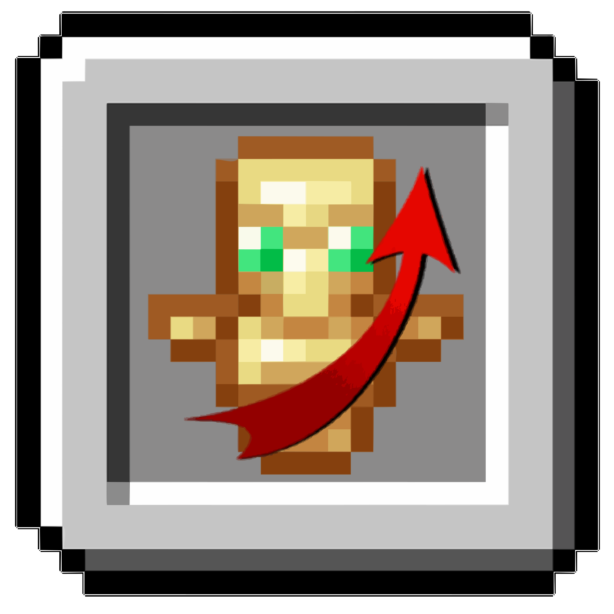

**English** | [Русский](README.ru.md)

  

# Simple Overhand Swap (EN)

**Simple Overhand Swap** is a small client-side mod for Fabric that prevents accidental swapping of the held item between the main hand and offhand. In vanilla Minecraft, pressing the `F` key instantly swaps items between hands, which can often interfere with PvP or crystal PvP gameplay. This mod blocks offhand swapping only when the inventory is closed. It also works correctly even if you rebind the `swapHandsKey` action to another key.

## Features

- Blocks offhand swapping during normal gameplay.
- Keeps swapping functional when the inventory is open.
- Works entirely on the client side.
- Functions properly when the `F` key is rebound.

## Why use it?

The mod is especially useful in crystal PvP — it lets you safely bind the `F` key without risking accidental hand swaps.
Even in regular gameplay, if you've ever accidentally moved your sword, shield, or totem from your main hand at the wrong moment, this mod prevents that frustration.

## Compatibility

- Fabric Loader 0.15+
- Compatible with Mod Menu and other client-side mods
