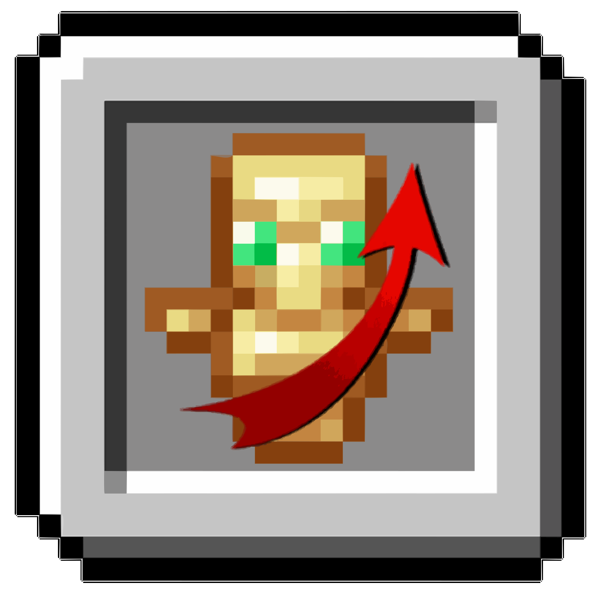

[English](README.md) | **Русский**

  

# Simple Overhand Swap (RU)

**Simple Overhand Swap** — это небольшой клиентский мод для Fabric, предотвращающий случайный перенос (свап) предмета в левую руку и наоборот.
В ванильном Minecraft нажатие клавиши `F` мгновенно меняет предметы между руками, что часто мешает в pvp и crystal pvp.
Мод блокирует перенос в левую руку только когда инвентарь закрыт. Мод работает корректно даже если переназначить действие `swapHandsKey` на другую клавишу.

## Возможности

- Блокирует перенос предмета в левую руку во время обычной игры.
- Сохраняет возможность переноса при открытом инвентаре.
- Работает только на стороне клиента.
- Корректно работает при переназначении клавиши `F`

## Зачем это нужно?

Мод полезен в crystal pvp, он позволяет забиндить клавишу `F`
Во время обычног игры: если ты хоть раз случайно убирал меч, щит или тотем из основной руки в самый неподходящий момент — этот мод решает проблему.

## Совместимость

- Fabric Loader 0.15+
- Совместим с Mod Menu и другими клиентскими модами
